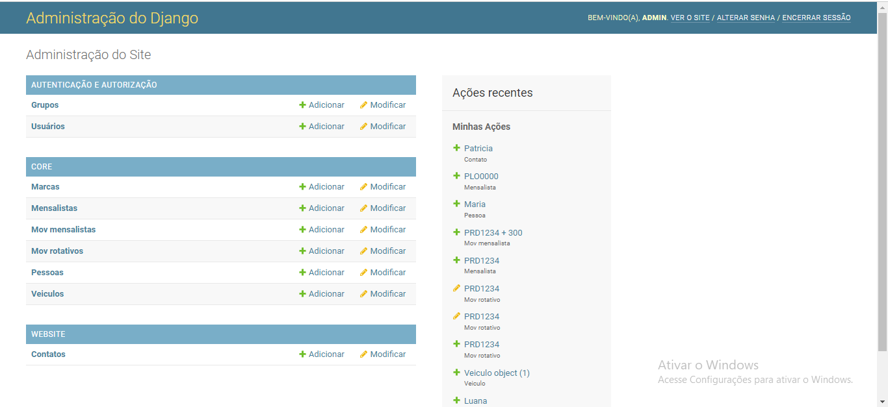
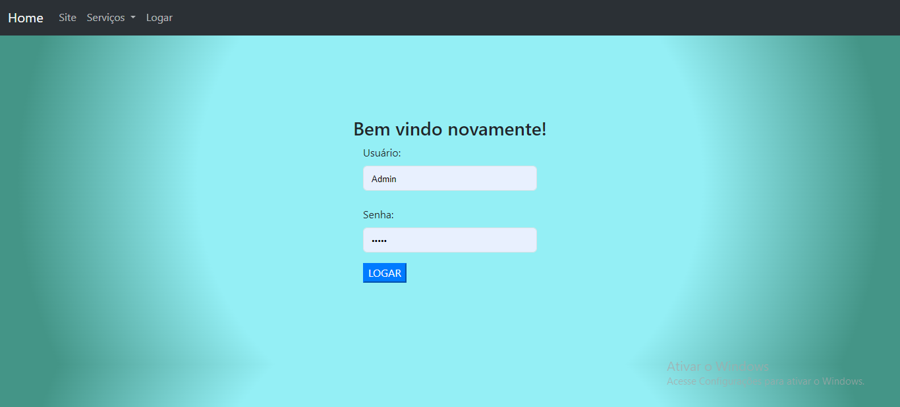
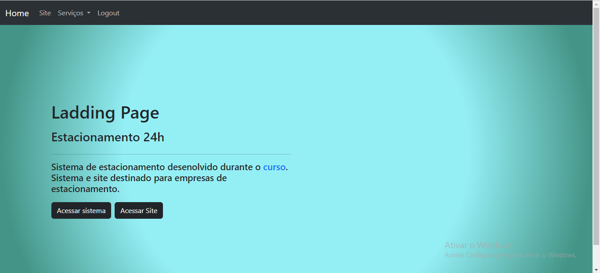
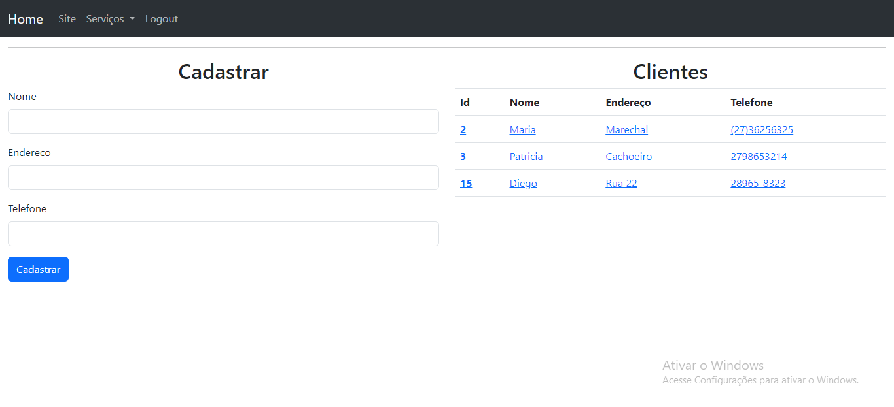
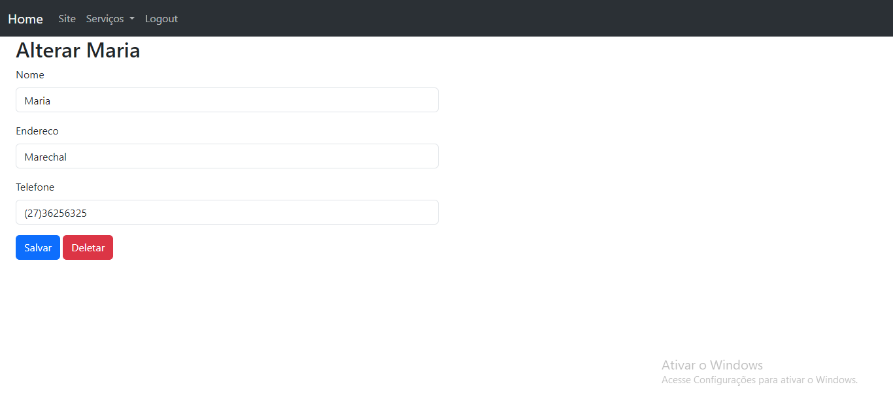
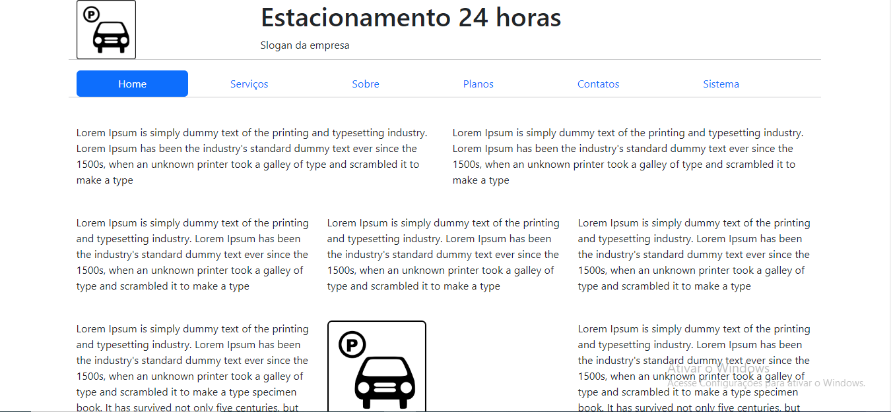

<div align="center" id="header">
  <a href="#" text-align: center></a>
</div>

## Sistema de Estacionamento

<div>
 Porjeto desenvolvido durante o curso: "Curso Programador Web 2.0 Moderno 2022 Python, Django, React"

</div>


<!-- ============== LANGUAGE ============== -->
## Linguagens e ferramentas

```
> Python3
> Django
> Bootstrap
> HTML5
> CSS3
> Venv
> Javascript
> Git
```

<!-- ============== INSTALLATION ============== -->
## Instalação

```
https://github.com/PatriciaDaros/Sistema-de-Estacionamento-com-Django.git
```


<!-- ============== LICENSE ============== -->
## Lincença

Distributed under the MIT License. See `LICENSE` for more information.

## Telas 

<div align="center" id="header">
  Área administrativa do próprio django.
  <a href="#" text-align: center></a>
</div>

<div align="center" id="header">
  Login
  <a href="#" text-align: center></a>
</div>

<div align="center" id="header">
  Lading Page
  <a href="#" text-align: center></a>
</div>

O sistemas possui as funcionalidades de cadastro, alteração  e delete das movimentações de veiculos, mensalistas, pessoas e veiculos.

<div align="center" id="header">
  Cadastro
  <a href="#" text-align: center></a>
  Update
  <a href="#" text-align: center></a>
</div>

<div align="center" id="header">
  Vinculado ao sistema adminstrativo existe um site. 
  <a href="#" text-align: center></a>
  Com funcionalidades como integração de mapa e envio de dados via formulário.
  <a href="#" text-align: center></a>
</div>

<!-- ============== AUTHOR ============== -->
## Autor

[<br><sub>@PatriciaDaros</sub>](https://github.com/PatriciaDaros)

<p align="right">(<a href="#header">back to top</a>)</p>

